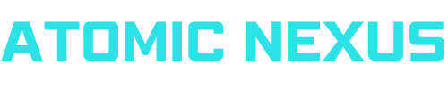

# Atomic Nexus

## 🚀 Ignite Growth with AI-Powered Strategy & Insights
**Atomic Nexus** helps forward-thinking entrepreneurs master AI and automation through expert education and consulting—unlocking new opportunities for growth and innovation.

---

## 🌟 Features & Offerings

### 🔹 AI Education
- **Cut Through the AI Hype** – Get clear, actionable insights on AI without the confusion.
- **Real-World Applications** – Learn how AI is transforming industries.
- **Stay Ahead of the Curve** – Make informed decisions and leverage AI for growth.

### 🔹 AI Strategy Consulting
- **Strategic AI Roadmaps** – Identify the best AI solutions tailored to your business.
- **Maximize ROI** – Avoid costly mistakes and ensure high-impact AI adoption.
- **Access Trusted AI Partners** – Connect with vetted AI solution providers.

### 🔹 Partnerships & Implementation
- **From Strategy to Execution** – Work with experts to bring AI solutions to life.
- **Pre-Vetted AI Agencies** – Get the right solutions without guesswork.
- **Guidance & Support** – Navigate the AI landscape with confidence.

---

## 🖥️ Tech Stack
- **Next.js** (App Router & TypeScript)
- **Tailwind CSS** for styling
- **Framer Motion** for animations
- **Shadcn/ui for  building the component library**
- **Magic UI for components**
- **Lucide Icons**

---

## 🎨 Branding & Design
### **Color Palette**
| Name            | HEX      | Usage |
|---------------|---------|-----------------------------|
| Rich Black    | #030014 | Primary background |
| Russian Violet | #190e36 | Secondary background, overlays |
| Blue Violet   | #8646f4 | Primary highlights, CTA buttons |
| Cool Gray     | #9190a0 | Text, lines, dividers |
| White         | #ffffff | Headings, logo text |
| Electric Cyan | #2de2e6 | Secondary highlights, hover effects |
| Neon Magenta  | #ff2079 | Alert messages, secondary CTA buttons |
| Luminous Gold | #ffb800 | Premium highlights, special UI elements |

### **Typography**
- **Primary Font**: Poppins (Google Fonts)
- **Typography optimized for readability and clarity**

## 🔗 Get in Touch
- **Website**: [Atomic Nexus](#)
- **LinkedIn**: [Your LinkedIn](#)
- **YouTube**: [Your YouTube Channel](#)

⚡ *Empowering businesses with AI-driven education & strategic consulting!*
